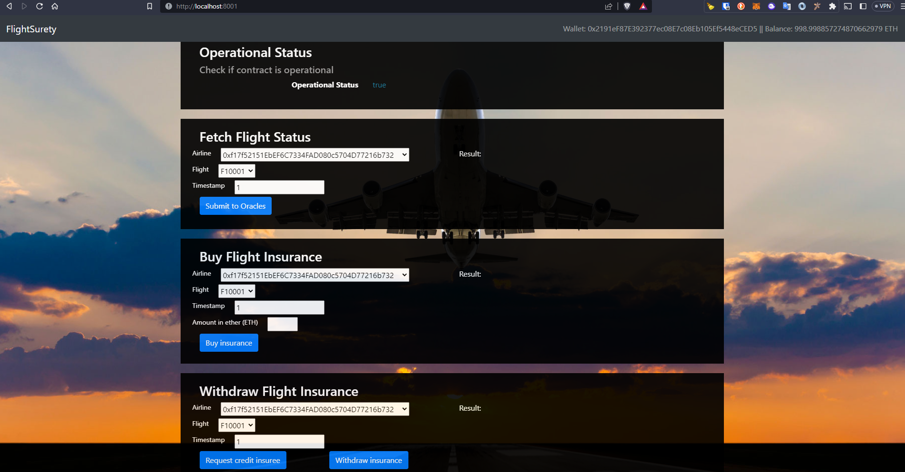

# FlightSurety

FlightSurety is a sample application project for Udacity's Blockchain course.

## Technologies used
- Truffle v5.7.6 (core: 5.7.6)
- Ganache v7.7.3
- Solidity - ^0.4.24 (solc-js)
- Node v16.19.0
- Web3.js v1.8.2

This repository is organized as follows:
- `contracts` - directory where all solidity files are
- `migrations` - scripts to perform migration of contracts to the blockchain
- `src/dapp` - files related to the dapp 
- `src/server` - files related to the oracle server 
- `test` - test files

Follow the steps below accordingly.

## Install

To install, download or clone the repo, then:

`npm install`

`truffle compile`

Start ganache:

`bash ./run_ganache.sh`

## Develop Client

Open another terminal to run truffle tests:

`truffle test ./test/flightSurety.js`

`truffle test ./test/oracles.js`

To use the dapp, run the commands below in a new terminal:

`truffle migrate`

`npm run dapp`

## Develop Server

Start server in a new terminal:

`npm run server`

At this point, all flights and oracles have been registered successfully:

Open the browser in `http://localhost:8001` to interact with the dapp.

The dapp loads with the default values in the forms, just click the buttons to perform the operations and the results will appear on the right side of each panel.

- `Fetch flight status` will send events to the oracles and receive random statuses of the flights back.
- `Buy flight insurance` allows the user to buy at most 1 ether of insurance for a flight
- `Withdraw flight insurance` has two operations to be performed in order the user to withdraw the funds. First click the `Request credit insuree` to register the withdraw intent and once successful click `Withdraw insurance` to receive the funds back. Obs: The user must have the insurance and the flight must be "Late airline" status.

